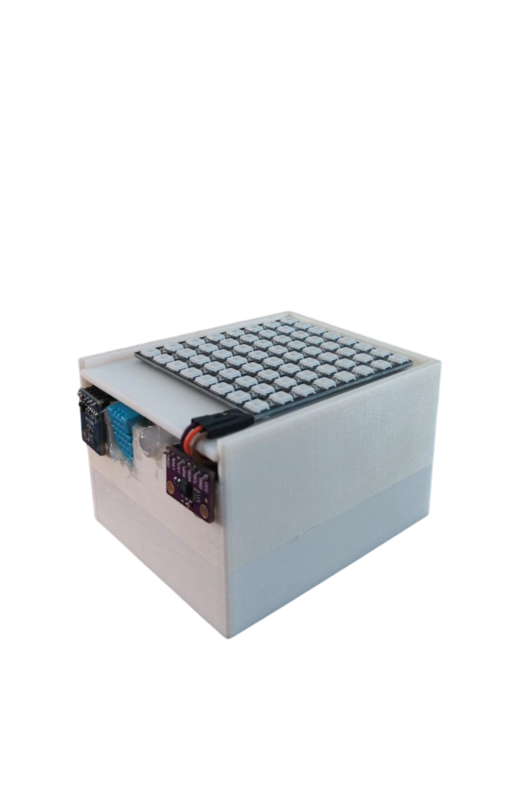

🧠 Smart Classroom – IoT riešenie pre kvalitnejšie vyučovanie

Smart Classroom je inteligentný IoT systém založený na mikrokontroléri ESP32, ktorého cieľom je zlepšiť podmienky pre študentov počas vyučovania monitorovaním a automatickým reagovaním na prostredie v triede. Projekt využíva viaceré senzory a výstupné zariadenia na zabezpečenie komfortu a zdravého vnútorného prostredia pri pobyte v triede.
_________________________________________________________________________
🔍 Senzory:

•	DHT11 – meranie teploty a vlhkosti

•	BH1750 – meranie intenzity osvetlenia v luxoch

•	CCS811 – monitorovanie kvality vzduchu (VOC, CO₂)
_________________________________________________________________________
📤 Výstupy systému:

•	Mobilná aplikácia (Blynk IoT): zobrazuje hodnoty v reálnom čase (teplota, vlhkosť, svetlo, kvalita vzduchu)

•	RGB LED dióda:

  +	Zelená – podmienky v triede sú ideálne

  +	Žltá – mierne zhoršené podmienky

  +	Červená – nevhodné podmienky (napr. vysoké CO₂, teplota alebo slabé svetlo)

•	LED matica: Automaticky mení intenzitu osvetlenia, aby sa udržiavalo približne 700 luxov

•	Červená LED dióda: Imituje aktiváciu rekuperačného systému, keď je kvalita vzduchu zlá
_________________________________________________________________________
🎯 Ciele projektu:

•	Zlepšiť koncentráciu, komfort a zdravie študentov v triede

•	Automatizovať sledovanie a reakciu na podmienky ako osvetlenie a kvalita vzduchu

•	Vizualizovať informácie prehľadne a intuitívne
_________________________________________________________________________
📚 Praktické využitie:

•	V reálnom čase môže učiteľ alebo technik sledovať hodnoty prostredníctvom aplikácie

•	Trieda je automaticky osvetľovaná podľa potreby a upozornená LED svetlom, ak sa podmienky zhoršia

•	Systém môže slúžiť ako základ pre rozšírené automatické vetranie, ovládanie svetiel či integráciu so školskou infraštruktúrou

